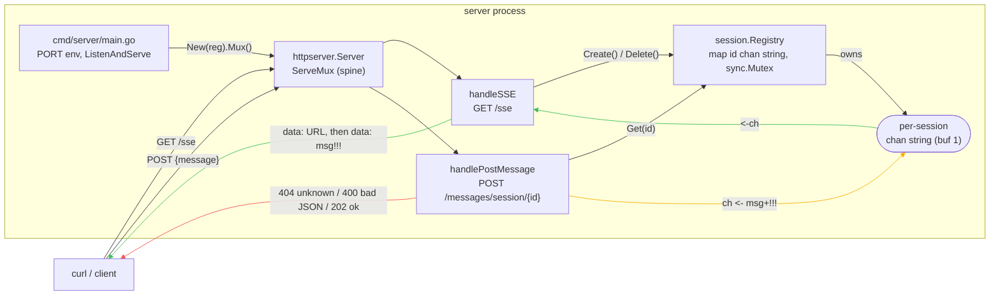
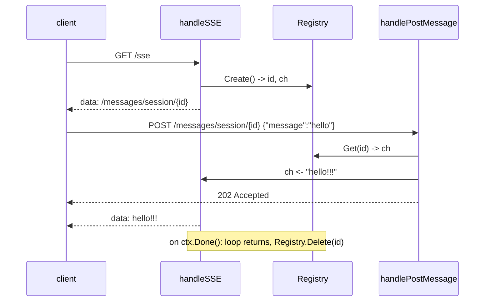

# ae-arch: async-server-echo

> **Status:** Reviewed
> **Last updated:** 2026-09-05
> **From:** docs/ae-plan/async-server-echo.md

**design as proposed**

Minimal async HTTP server: a client opens `GET /sse` and keeps it open; the
first event is the client's personal message URL `/messages/session/{id}`. The
client `POST`s JSON to that URL and the message comes back on the same SSE
stream with `!!!` appended. No agent loop, no LLM, no persistence — just the
transport wiring.

## Components

| Package | Responsibility |
| --- | --- |
| `internal/session.Registry` | `map[id]chan string` behind a `sync.Mutex`; `Create()`, `Get(id)`, `Delete(id)` |
| `internal/httpserver.Server` | `ServeMux` with `GET /sse` and `POST /messages/session/{id}` |
| `cmd/server/main.go` | wires `Registry` into `Server`, `http.ListenAndServe` (`PORT`, default `8080`) |

The two handlers never call each other — they rendezvous only through the
per-session buffered `chan string` (buffer 1) held in the `Registry` map.

## Diagram

## Sequence (round trip)

## Notes

- Malformed JSON on `POST` returns `400`; unknown session id returns `404`;
  happy path returns `202`.
- `handleSSE` sets `Content-Type: text/event-stream`, flushes via
  `http.NewResponseController(w).Flush()`, and calls `Registry.Delete(id)` on
  loop exit to avoid unbounded map growth and blocking-send leaks.
- Channel buffer of 1 keeps a POST arriving mid-flush from deadlocking.

## Other

**components**
- `internal/session.Registry` — owns session bookkeeping. in: `Create()` (nothing) / `Get(id)`. out: `(id, chan string)` / `(chan string, bool)`.
- `internal/httpserver.Server` — translates HTTP <-> session channel for both routes. in: `*http.Request`. out: SSE bytes on the response writer, or a status code.
- `cmd/server/main.go` — wires Registry into Server and starts the listener. in: `PORT` env. out: running process.

**entry / spine / exit** `cmd/server/main.go` (ListenAndServe) / `internal/httpserver.Server` handlers / two exits — SSE stream ends on `ctx.Done()` (GET), status code written (POST). Worth naming both explicitly since they're different shapes.

**boundaries**
- nothing

**connections**
- `handleSSE` and `handlePostMessage` never call each other — they rendezvous only through the `chan string` sitting in `Registry`'s map. Correct (mutex-protected), but the plan's Approach doesn't say this out loud; the diagram above is the first place it's drawn. Worth a line in the plan so a future reader doesn't miss it.

**edges**
- `Registry.Create` calls `uuid.NewString()` inline — a randomness edge with no seam. Low priority here since tests only check the returned id round-trips, not a specific value.
- `handlePostMessage`'s `ch <- msg+"!!!"` is a blocking send with no `select`/timeout. If the session's reader is gone but the entry wasn't cleaned up (see **state**), this POST hangs forever and leaks the handler goroutine.

**state**
- `Registry` entries are created on every `GET /sse` and never removed. No `Delete` in the plan's Approach or Files to change. Two consequences: unbounded map growth, and the blocking-send hang above once a client disconnects mid-session. Add `Registry.Delete(id)` and call it from `handleSSE` when its loop returns.

**failure flow**
- Malformed JSON on `POST /messages/session/{id}` has no defined response in the Red/Green cycles (cycle 5 only covers the known-id happy path). Unknown-id gets 404 (cycle 3), but bad-body doesn't get an equivalent 400 — two failure causes, one handled shape. `analysis/crush/internal/server/proto.go`'s `jsonError(w, http.StatusBadRequest, ...)` is the existing pattern to copy for the other.

**A -> B fit**
- nothing — every reproduce-table row in `docs/ae-init/async-server-echo.md` maps to a cycle (GET/first-event -> cycles 7-8, POST/echo -> cycles 3-6).

**fit with the repo**
- No existing Go pattern in this repo yet (first Go code); against the cited reference (`analysis/crush`), a single per-session channel instead of crush's generic pubsub `Broker` is a reasonable, deliberate simplification for a single-subscriber slice — not a smell.

**next change**
- swap echo for real agent-loop call: touches `internal/httpserver.handlePostMessage` only
- session cleanup on disconnect (the state finding above): touches `internal/session.Registry` (add `Delete`), `internal/httpserver.handleSSE` (call it) — two components, not too wide
- reconnect support (an open question in the plan): touches `Registry` (reuse-vs-create) and `handleSSE` — two components

**simplicity**
- nothing — three components, no unused config, no plugin point with one plugin

**build?** yes | after: add `Registry.Delete` + call it when `handleSSE`'s loop exits (state), and define the malformed-JSON response as a 400 before subtask 4's Green step (failure flow)
